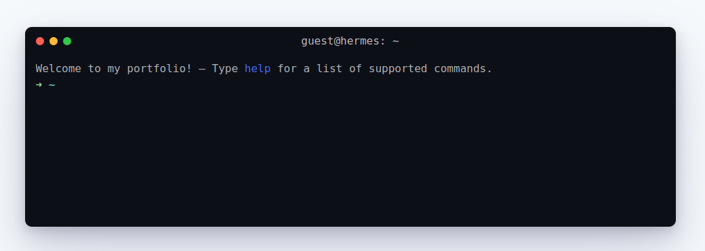

<h1 align="center">Warthog 👨‍💻</h1>

## Overview
Quick lookback! "Warty Warthog" was the codename for the first Ubuntu release. In memory of that, I coded this portfolio in terminal version, a **CLI resume**. I hope you enjoyed using it as much as I enjoyed coding it

[Checkout the demo](https://claymeers.github.io/Warthog/)

### Built With
- [HTML](https://developer.mozilla.org/en-US/docs/Web/HTML)
- [CSS](https://developer.mozilla.org/en-US/docs/Web/CSS)
- [JavaScript](https://developer.mozilla.org/en-US/docs/Web/JavaScript)

## Features
### Basic commands
Just type any of the commands below to get some more info.
- [x] `help` : Displays help
- [x] `about` : Displays information about me 
- [x] `skills` : I'm pretty good at some things
- [x] `hobbies` : Display the list of my hobbies
- [x] `contact` : Let catch up!
- [x] `clear` : Clear the terminal
- [x] `experience` : Yeah, I've made some cool stuff before
- [x] `get cv` :  : Download my CV [pdf]
- [x] `education` : my journey
- [ ] `quote` : Get a random quote
- [ ] `repo` : Take a look at some of my work
- [ ] `date` : Displays current date and time
- [ ] You can use the [TAB] key to autocomplete a command
- [ ] You can find old commands with the up and down arrows.
- [ ] Easter Eggs : `sudo rm -rf` , `party` : Check it out
 
## Resources
- [Confetti](https://github.com/catdad/canvas-confetti) - for confetti

## Author

Warthog is developed by [@Naveen](https://github.com/claymeers)